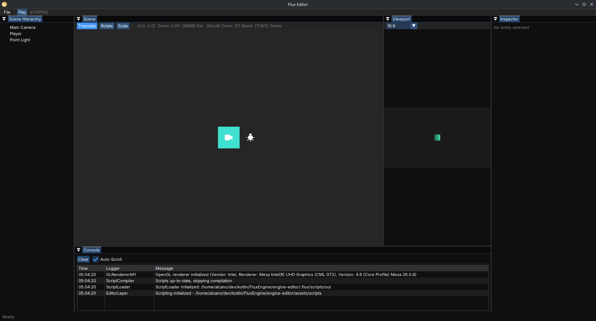

# Flux Engine - Kotlin Game Engine

## About
This project is a custom-built game engine currently in the sandbox stage.
My primary focus here is on **software architecture, efficient resource management 
and hardware interaction via the JVM**.

I use this project as an experimental learning environment 
to gain a practical understanding of complex system structures and memory management-concepts

## Tech Stack & Tools
* **Language:** Kotlin
* **Build System:** Gradle
* **Core Technologies:** LWJGL, OpenGL, GLFW, ImGui

## Core Features (Current State)
* [x] Established core architecture with modular design
* [x] Implemented basic rendering pipeline using OpenGL
* [x] Integrated ImGui for in-engine debugging and UI development
* [x] Separate module for editor application
* [x] Scripting with Kotlin
* [ ] Game Deployment

## Glimpse into the Editor

## Why Kotlin?
Kotlin allows me to design a modern, type-safe and
expressive architecture while maintaining full access to the 
Java Virtual Machine ecosystem and its performance capabilities